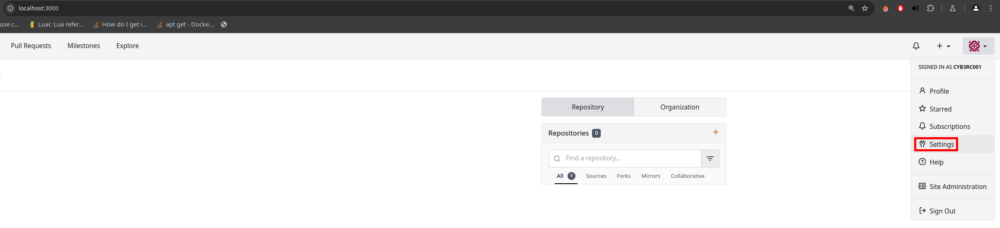
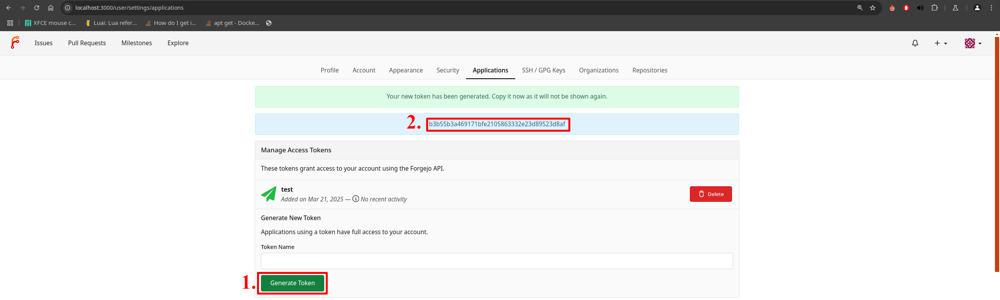

# Инструкция по разворачиванию Forgejo с использованием Docker
Чтобы запустить в Docker контейнере Forgejo необходимо выполнить команду:
```docker-compose up -d```

На localhost:3000 открывается Forgejo, необходимо пройти регистрацию и создать репозиторий.

Для подключения простейшего клиента к данному localhost необходимо передать ему ссылку на репозиторий и API токен.

Получить токен можно через "Settings" -> "Generate Token":




Далее необходимо отредактировать файл `pyforgejo/.env`, и изменить `API_TOKEN`, `BASE_URL`, `REPO_OWNER` и `REPO_NAME`.

Например:
```
API_TOKEN=b3b55b3a469171bfe2105863332e23d89523d8af
BASE_URL=http://localhost:3000
REPO_OWNER=cyb3rc001
REPO_NAME=test123
```